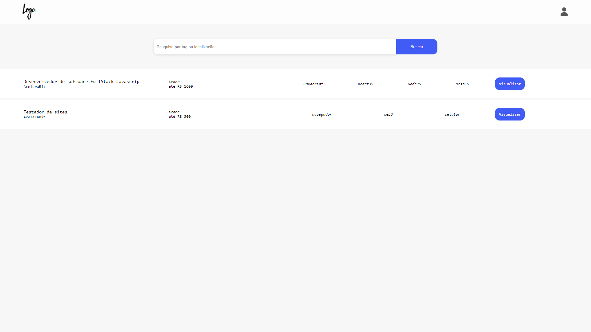

<h1 align="center">
   Página de Recrutamento
</h1>

## 
 <u>Preview da página:</u> 

  

> A aplicação permite postar e acessar vagas de trabalho criadas por empresas

<h4 align="center"><a href="https://tahaluh.github.io/recruit-page-react-frontend/#" target="_blank">Clique para visitar o projeto</a></h4>

---
# 💼 Tecnologias Utilizadas

As seguintes ferramentas foram usadas na construção do projeto (Front-end):

- ReactJS
- Axios

*Também foram aplicados conceitos de responsividade*

# ⚙️ Instalação

### Client

  1. Atualize o arquivo Env com o link da [api](https://github.com/tahaluh/recruit-page-nestjs-backend)
  2. `$ npm install`
  3. `$ npm start`

# 🛠️ Funcionalidades

- Criar conta de usuário
- Registrar empresa relacionada a conta de usuário
- Postar vagas de emprego
- Acessar vagas de emprego
- Deletar vagas

### Ajustes e melhorias

O projeto ainda está em desenvolvimento e as próximas atualizações serão voltadas nas seguintes tarefas:

- [ ] Refinar sistema de login e autenticação e seus tratamentos de erros
- [ ] Resolver bug do reactRouter que vai para a página inicial ao clicar no menu
- [ ] Adicionar funcionalidade ao botão "Candidatar-se"
- [ ] Adicionar a possibilidade de uma empresa ver e aprovar ou rejeitar os usuário candidatados em sua vaga

---

Feito por Thauã Magalhães 👋🏽 Entre em contato!

 

